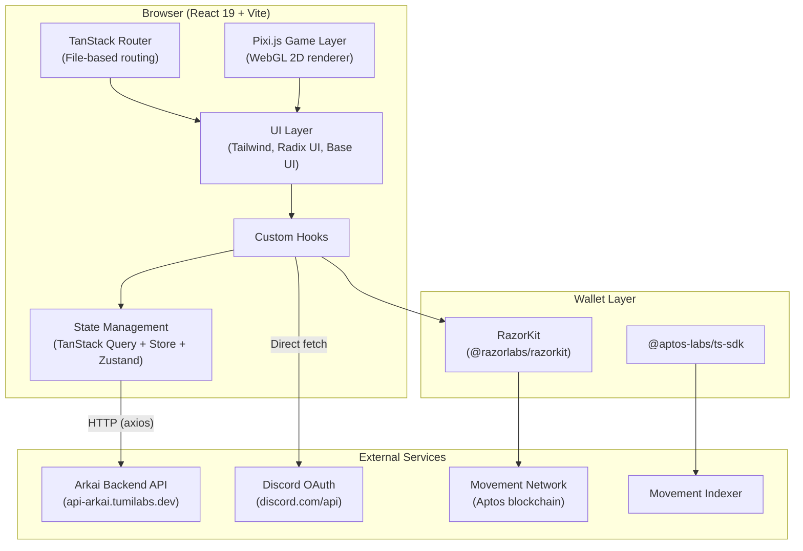
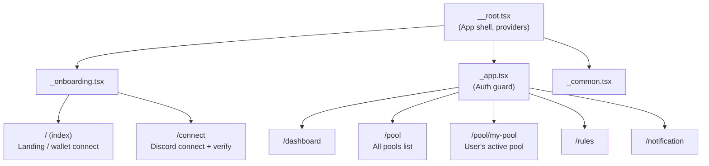
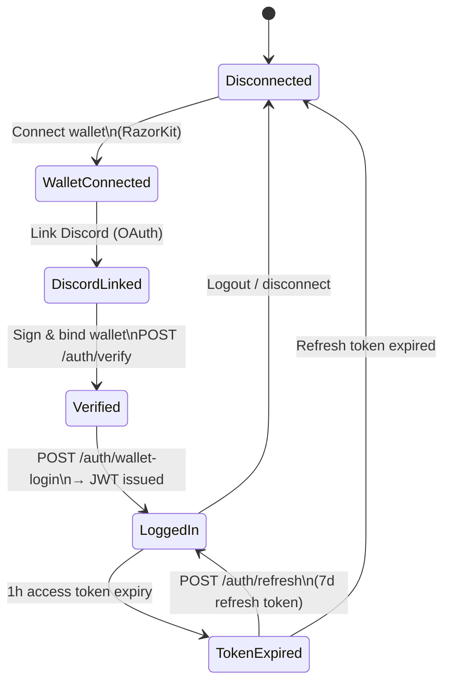
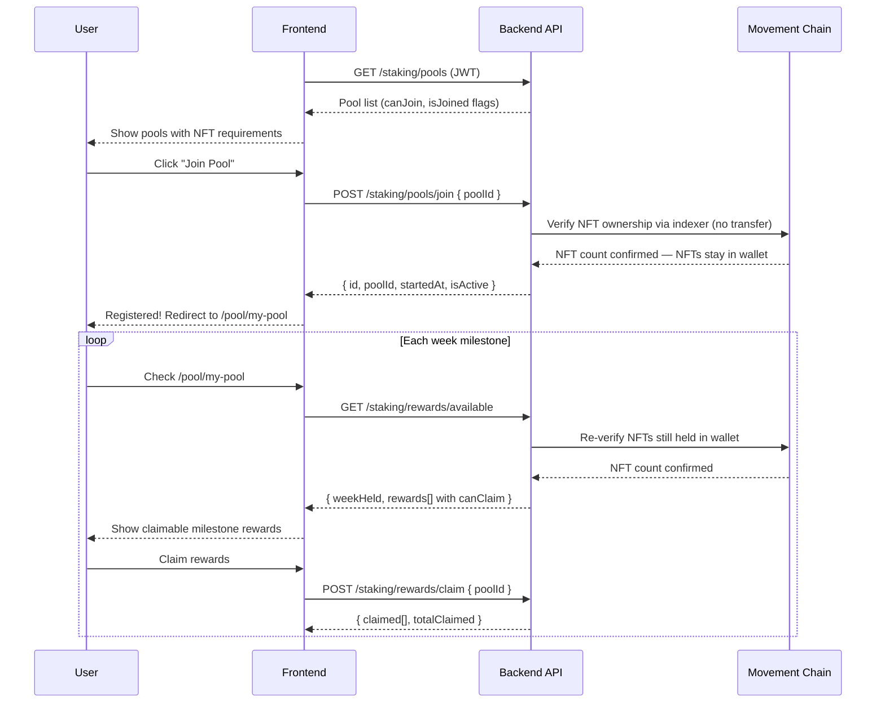

# Architecture

> Arkai NFT Staking Platform — system architecture reference. **"Staking" is the product name; users hold NFTs in their wallet — no on-chain locking occurs.**

---

## High-Level System Diagram

---

## Frontend Layer Architecture

```mermaid
graph LR
    subgraph routes["Routes (src/routes/)"]
        R1["/_onboarding\n index, connect"]
        R2["/_app\n dashboard, pool,\n my-pool, rules,\n notification"]
        R3["/_common\n shared routes"]
    end

    subgraph components["Components (src/components/)"]
        CL["layouts/\nHeader, Footer, Notification"]
        CUI["ui/\nbutton, dialog, dropdown,\nInkButton, loader, sonner"]
        CPG["playground/\nPixiPlayground + gameUI"]
        CW3["web3/\nWalletConnectButton"]
        CAI["animate-ui/"]
        CI["icons/"]
    end

    subgraph hooks["Hooks (src/hooks/)"]
        HA["authentication/\nuseLoginWithWallet\nuseConnectDiscord\nuseSignAndBindDiscord\nuseTokenManager"]
        HN["nfts/"]
        HP["pools/\nuseGetPools\nuseGetCurrentPool\nuseJoinPool\nuseGetPoolRewards\nuseClaimRewards"]
        HPG["playground/"]
    end

    routes --> components
    routes --> hooks
    components --> hooks
```

---

## Route Tree

---

## Authentication & State Flow

---

## Data Flow: Holding & Claiming Rewards

---

## Token Storage Strategy

| Token | Storage | Expiry |
|---|---|---|
| `accessToken` | `sessionStorage` | 1 hour |
| `refreshToken` | `localStorage` | 7 days |
| `arkai-wallet-login` | `localStorage` | Persisted |
| `arkai_token_redirect` | `localStorage` | OAuth flow |

- `sessionStorage` for access token — cleared on tab close, prevents XSS leakage across sessions
- `localStorage` for refresh token — persists across sessions for auto-login
