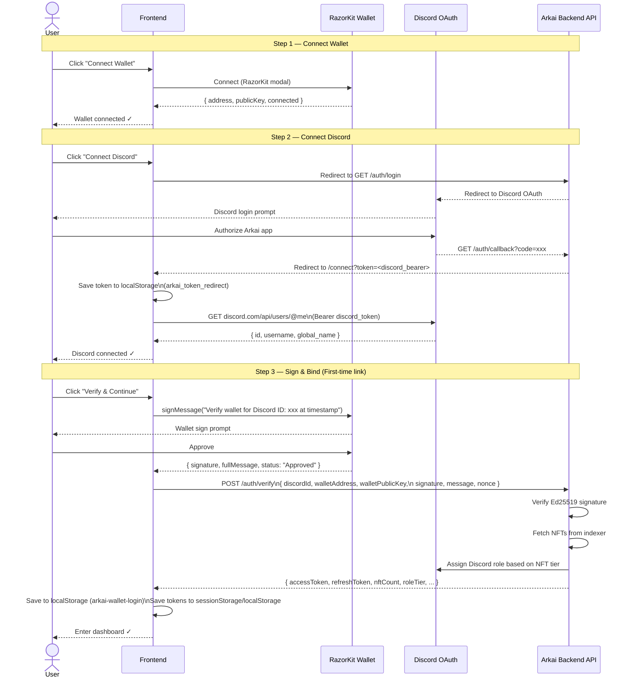
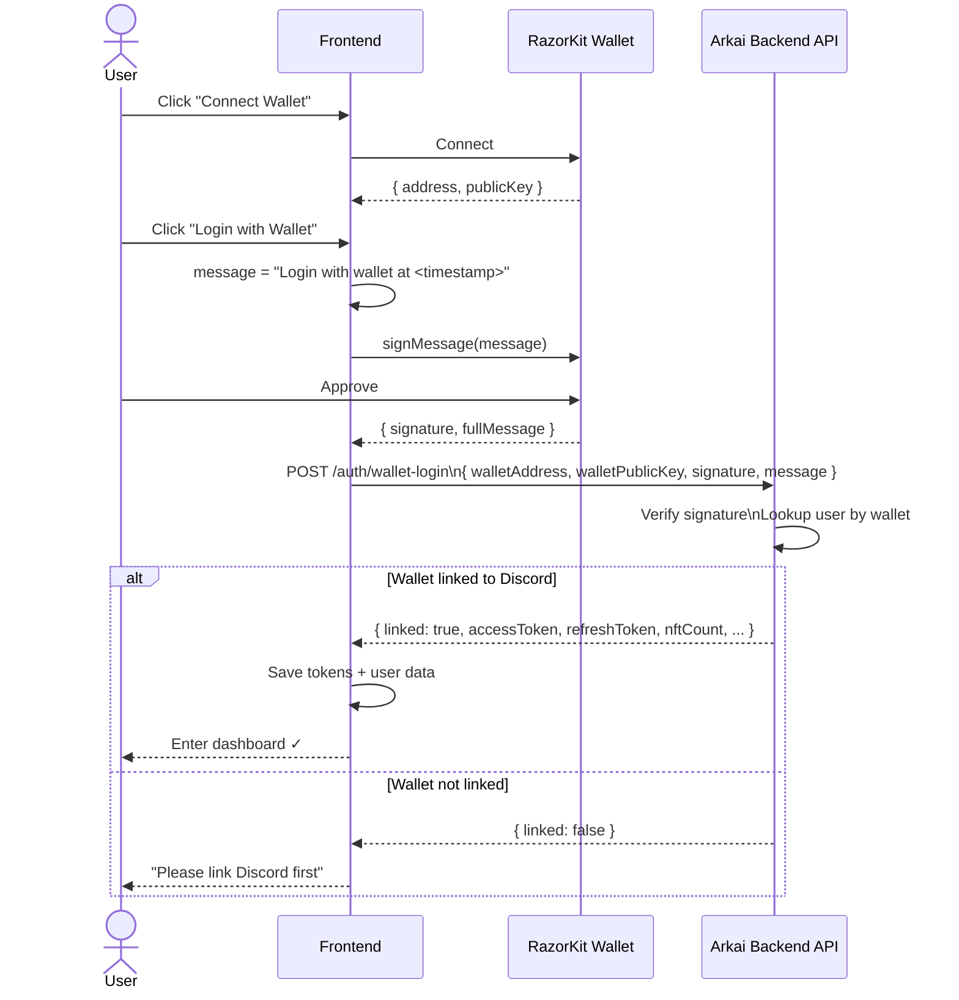
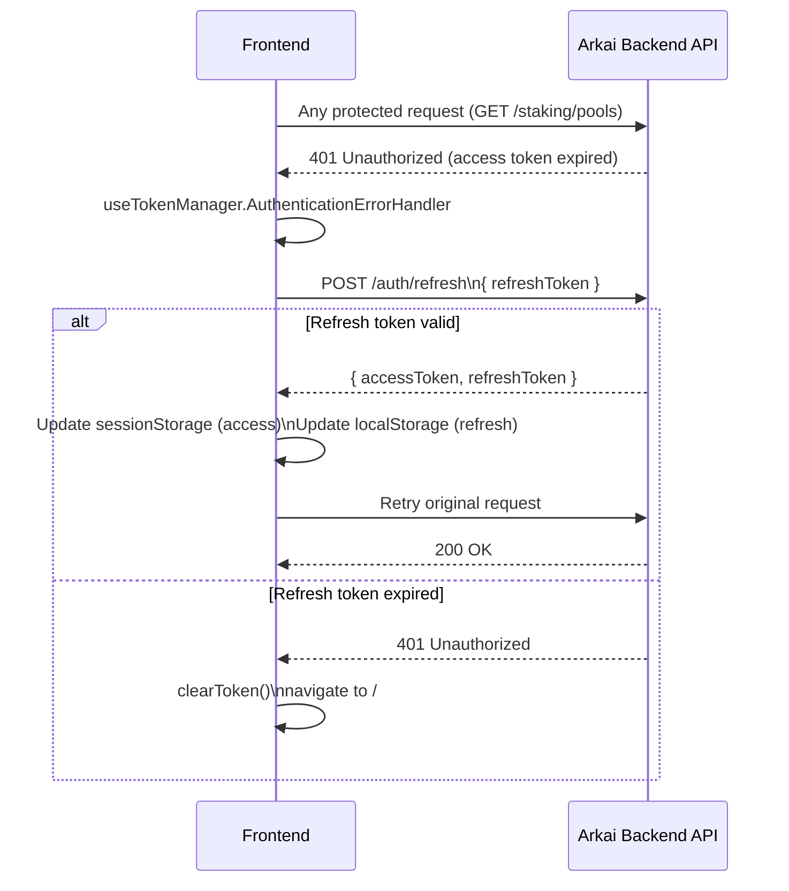

# Authentication Flow

> Deep-dive into how users connect their wallet and Discord account to access the Arkai NFT holding program.

---

## Overview

Arkai uses a **two-step authentication**:

1. **Wallet Login** — for users who already have wallet + Discord linked (returning users)
2. **Wallet Verify** — for first-time users linking wallet to Discord

Both flows produce a JWT `accessToken` (1h) and `refreshToken` (7d).

---

## Full Auth Sequence (New User)

---

## Returning User Login

---

## Token Refresh Flow

---

## Local Storage Keys

| Key | Storage | Value | Purpose |
|---|---|---|---|
| `arkai-wallet-login` | `localStorage` | `WalletLoginResponse` | Cached user data (address, discord, tier) |
| `arkai_token_manager_refresh_token` | `localStorage` | JWT refresh token | Auto-login across sessions |
| `arkai_token_manager_access_token` | `sessionStorage` | JWT access token | Per-session auth header |
| `arkai_token_redirect` | `localStorage` | Discord bearer token | Temporary, used during OAuth callback |

---

## Hook Responsibilities

| Hook | File | Responsibility |
|---|---|---|
| `useLoginWithWallet` | `authentication/useLoginWithWallet.tsx` | Wallet sign → POST /auth/wallet-login → store JWT |
| `useConnectDiscord` | `authentication/useConnectDiscord.tsx` | Discord OAuth redirect → fetch Discord user via `@me` |
| `useSignAndBindDiscord` | `authentication/useSignAndBindDiscord.tsx` | Sign + bind Discord to wallet → POST /auth/verify |
| `useTokenManager` | `authentication/useTokenManager.tsx` | Token CRUD, auto-refresh, auth header builder |

---

## Route Guards

- `_app.tsx` — wraps all `/dashboard`, `/pool`, etc. routes. Redirects to `/` if no valid session.
- `_onboarding.tsx` — landing and connect flow. Accessible without auth.

---

## Security Notes

- **Replay attack prevention**: login messages include `Date.now()` timestamp
- **Ed25519 signatures**: wallet public key verified server-side against signature
- **Refresh token rotation**: old refresh token revoked on each refresh
- **Access token in sessionStorage**: cleared on tab close, not accessible cross-origin
